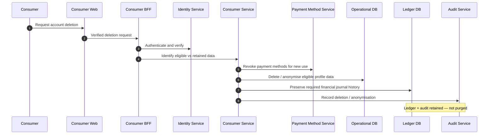

# Consumer Deletion

## Purpose

Authenticated deletion request: revoke access and payment methods, delete/anonymise eligible profile data, preserve required ledger and audit history. Financial journal entries are not deleted.

## Preconditions

- Verified consumer identity / deletion request.
- Retention rules classify eligible vs retained data.

## Mermaid

## Important invariants

- Ledger and required audit history preserved.
- Payment methods revoked for future use.
- Eligible PII deleted or anonymised per NFR-PRIV-*.

## Failure notes

- Incomplete verification → no deletion.
- Never hard-delete required financial journals.

## Related

LikeC4 dynamic view `consumerDeletion`.
