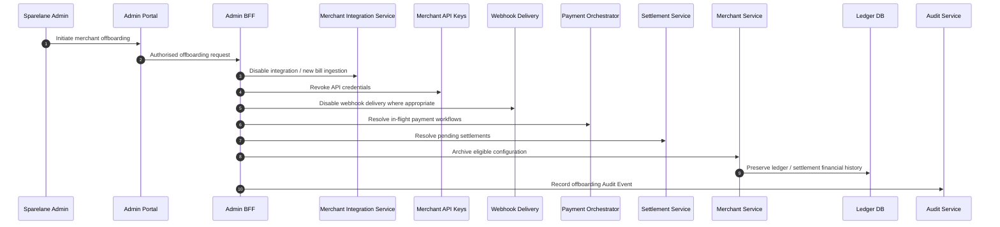

# Merchant Offboarding

## Purpose

Disable ingestion and credentials, resolve in-flight workflows and settlements, archive eligible configuration, preserve reconciliation, ledger, and audit history. Financial history is not destroyed.

## Preconditions

- Authorised admin offboarding request (MFA / privileged path).
- Product rules for in-flight payment and settlement resolution.

## Mermaid

## Important invariants

- Financial and reconciliation history preserved.
- New bill ingestion and credentials stopped.
- Merchant invoice SoR remains merchant-side (ADR-007).

## Failure notes

- In-flight money paths must complete or cancel under explicit rules before archival.

## Related

LikeC4 dynamic view `merchantOffboarding`.
