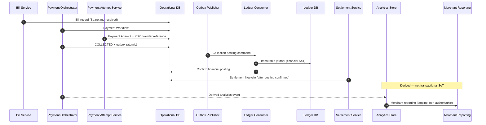

# Successful Payment Data Path

## Purpose

Authoritative vs derived stores for a successful collection: operational bill/workflow/attempt, ledger journal (financial SoT), settlement lifecycle, then analytics for reporting.

## Preconditions

- Collection attempt succeeded (CAPTURED → workflow COLLECTED).

## Mermaid

## Important invariants

- Ledger DB = financial source of truth.
- Operational DB = workflow / attempt / posting status SoT for operations.
- Analytics is not transactional SoT (ADR-015).

## Failure notes

- Analytics lag or loss must not affect money correctness.

## Related

LikeC4 dynamic view `successfulPaymentDataPath`.
