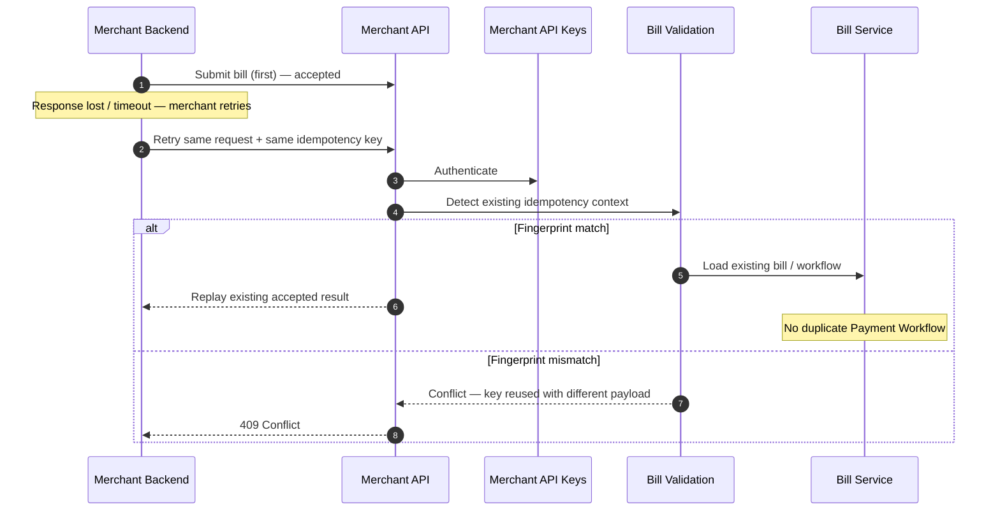

# Duplicate Bill Submission

## Purpose

Merchant safely retries after uncertainty (e.g. response lost). Same idempotency key + matching fingerprint returns the existing result. Mismatched fingerprint is a conflict.

## Preconditions

- Prior successful accept for the same merchant + idempotency key (fingerprint match case).
- Or a retry with same key but different body (conflict case).

## Mermaid

## Important invariants

- Same key + same fingerprint → idempotent replay; one workflow.
- Same key + different fingerprint → reject; do not silently overwrite.

## Failure notes

- Merchant must not mint a new key for a true retry of the same logical submit.

## Related

LikeC4: `duplicateBillSubmission`. ADR-008.
