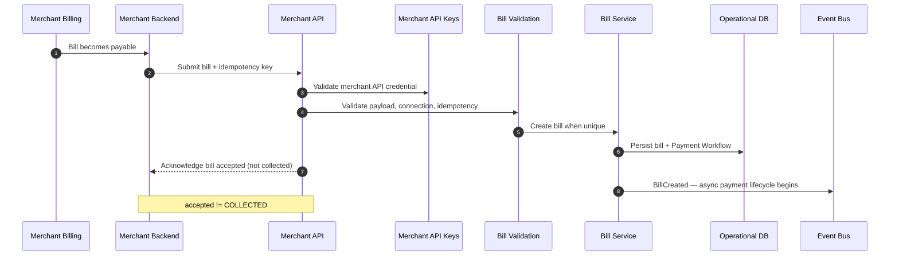

# Merchant Bill Submission

## Purpose

Merchant submits a recurring bill via Merchant API. Acknowledgement means bill accepted, not payment collected. Async payment reliability begins after acceptance.

## Preconditions

- Valid merchant API credential and bill scope.
- Eligible consumer connection.
- Idempotency key on request.

## Mermaid

## Important invariants

- Merchant remains billing SoR; Sparelane holds a projection for collection.
- Acceptance starts reliability workflow asynchronously.

## Failure notes

- Auth/validation failures return before persistence.
- Duplicates handled in SEQ-INT-002.

## Related

LikeC4: `billSubmission`. Also SEQ-PAY-001.
