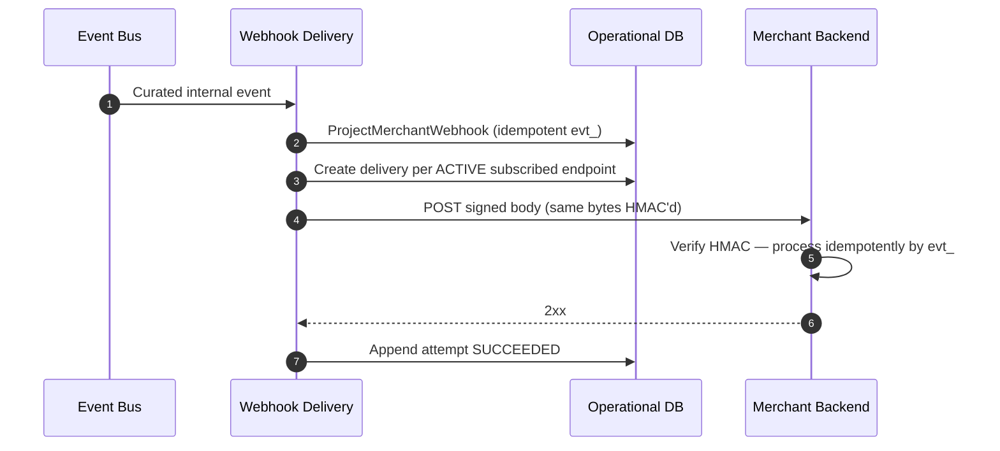

# Merchant Webhook Delivery

## Purpose

Internal domain event is mapped to a merchant-facing webhook, signed, and delivered. Merchants must process event IDs idempotently because delivery is at-least-once.

## Preconditions

- Curated merchant-facing event is eligible for delivery.
- Merchant webhook endpoint configured and active.
- Signing secret available from secrets management.

## Mermaid

## Important invariants

- Stable public Webhook Event ID across retries and endpoints.
- At-least-once delivery; merchant idempotency required.
- Only closed catalogue types (ADR-030). HTTP outside DB transaction.
- Duplicate internal events → same `evt_…`.

## Failure notes

- Timeout / 5xx → SEQ-INT-004 retry of same event ID.

## Related

LikeC4: `merchantWebhookDelivery`. ADR-009 / ADR-030.
