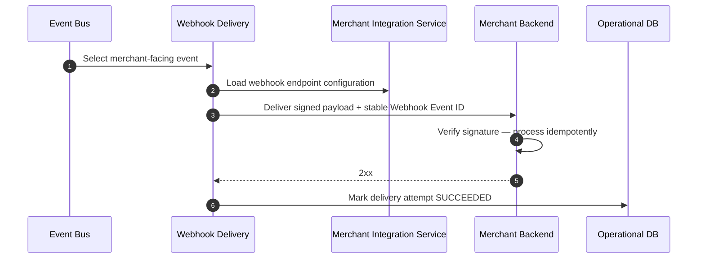

# Merchant Webhook Delivery

## Purpose

Internal domain event is mapped to a merchant-facing webhook, signed, and delivered. Merchants must process event IDs idempotently because delivery is at-least-once.

## Preconditions

- Curated merchant-facing event is eligible for delivery.
- Merchant webhook endpoint configured and active.
- Signing secret available from secrets management.

## Mermaid

## Important invariants

- Stable public Webhook Event ID across retries.
- At-least-once delivery; merchant idempotency required.
- Only curated external events (ADR-023).

## Failure notes

- Timeout / 5xx → SEQ-INT-004 retry of same event ID.

## Related

LikeC4: `merchantWebhookDelivery`. ADR-009.
