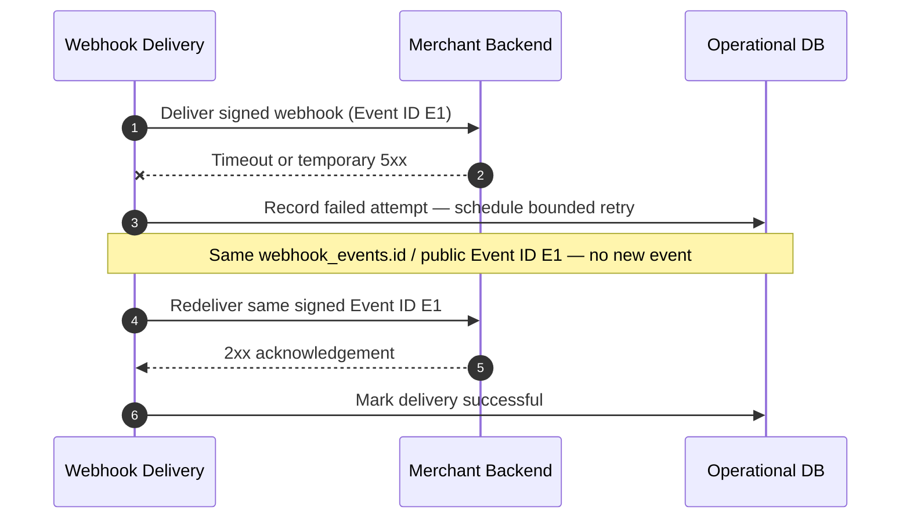

# Merchant Webhook Retry

## Purpose

Retryable webhook delivery failure schedules a bounded retry of the **same** Webhook Event ID. Retries do not create a new domain event.

## Preconditions

- Prior delivery attempt timed out or returned temporary 5xx.
- Bounded retry budget remains for the delivery.

## Mermaid

## Important invariants

- Retry reuses the same Webhook Event ID; no new domain event.
- Delivery attempts are append-oriented (PENDING → DELIVERING → SUCCEEDED / RETRY_PENDING / FAILED).
- Merchant must treat duplicate deliveries as idempotent.

## Failure notes

- Exhausted retries → delivery FAILED; ops may investigate; domain state unchanged.

## Related

LikeC4: `merchantWebhookRetry`. Schema webhook delivery attempts.
