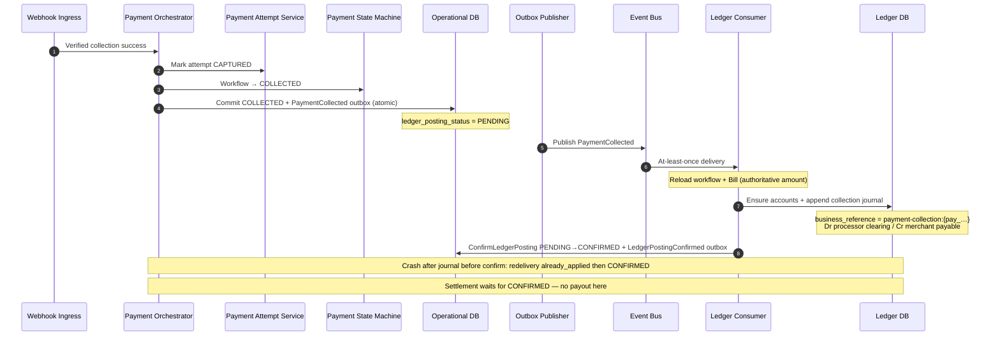

# Collection to Ledger

## Purpose

Successful PSP collection becomes Payment Workflow COLLECTED with an atomic outbox write; the Ledger Consumer appends the **ADR-026** collection journal idempotently, then confirms operational `ledger_posting_status = CONFIRMED`. Workflow state and ledger state remain distinct; consistency is eventual until posting is confirmed.

## Preconditions

- Verified provider success event for a collection attempt.
- Operational transaction can commit COLLECTED + outbox atomically.

## Mermaid

## Canonical journal (ADR-026)

| Leg | Side | Account | Amount |
| --- | --- | --- | --- |
| 1 | DEBIT | `sys:processor-clearing:{providerCode}:{currency}` | Bill `amount_minor` |
| 2 | CREDIT | `mrc:{merchantPublicId}:payable:{currency}` | Bill `amount_minor` |

## Important invariants

- Exactly one collection journal per successful collection (idempotent `business_reference`).
- Journal exists before `ledger_posting_status = CONFIRMED`.
- Settlement must not SUBMIT until posting CONFIRMED.
- Ledger posting failure leaves workflow `COLLECTED` (not payment FAILED).
- Ledger DB is financial source of truth; Operational DB holds workflow + posting status.
- No distributed transaction across ODB and LDB.

## Failure notes

- Transient ledger write failure → bounded infrastructure retry / recovery (SEQ-OPS-002). Not ADR-025 payment retry.
- Conflicting journal substance for same `business_reference` → integrity failure; remain PENDING; do not mutate journal.
- Do not mark SETTLED from this path.

## Related

LikeC4: `collectionToLedger`. ADR-016 outbox consistency. ADR-026 collection CoA.
