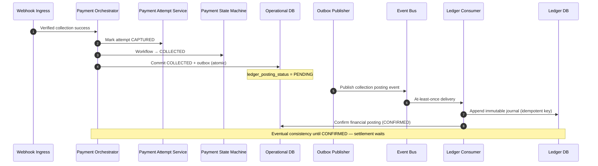

# Collection to Ledger

## Purpose

Successful PSP collection becomes Payment Workflow COLLECTED with an atomic outbox write; the Ledger Consumer posts an idempotent journal. Workflow state and ledger state remain distinct; consistency is eventual until posting is confirmed.

## Preconditions

- Verified provider success event for a collection attempt.
- Operational transaction can commit COLLECTED + outbox atomically.

## Mermaid

## Important invariants

- Exactly one collection journal per successful collection (idempotent consumer).
- Settlement must not SUBMIT until posting CONFIRMED.
- Ledger DB is financial source of truth; Operational DB holds workflow + posting status.

## Failure notes

- Transient ledger write failure → bounded retry / recovery (SEQ-OPS-002).
- Do not mark SETTLED from this path.

## Related

LikeC4: `collectionToLedger`. ADR-016 outbox consistency.
