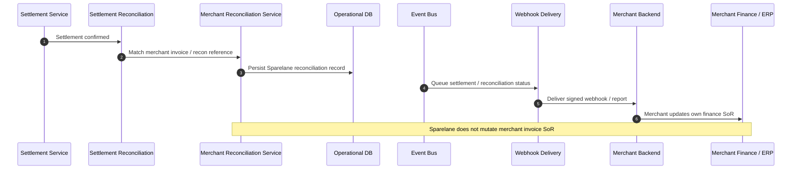

# Merchant Reconciliation

## Purpose

Confirmed settlement is matched to Sparelane settlement and merchant invoice/reconciliation references, then reported. Sparelane does **not** change the merchant invoice system of record.

## Preconditions

- Settlement confirmed (SETTLED path).
- Merchant reconciliation / invoice reference available on the original bill or settlement record.

## Mermaid

## Important invariants

- Merchant billing/invoice remains merchant SoR (ADR-007).
- Sparelane stores its own reconciliation projection only.
- Webhooks are at-least-once; merchant must key on event ID.

## Failure notes

- Unmatched reference → ops exception; do not invent merchant invoice updates.

## Related

LikeC4: `merchantReconciliationFlow`.
