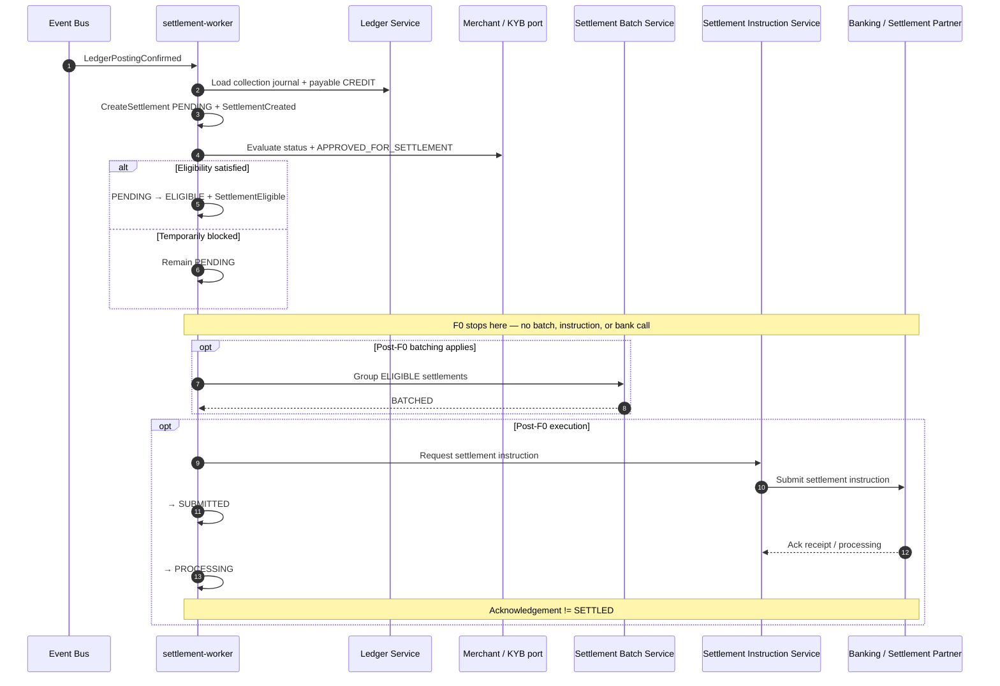

# Merchant Settlement

## Purpose

After ledger confirmation, settlement-worker creates a per-collection Settlement obligation (PENDING), evaluates eligibility (→ ELIGIBLE or remain PENDING), then — in later phases — optional batching and banking instruction. Partner acknowledgement is **not** SETTLED.

Binding policy: [ADR-027](../../decisions/ADR-027-settlement-obligation-eligibility-cardinality.md).

## Preconditions

- Payment Workflow is COLLECTED.
- Ledger posting status is CONFIRMED.
- ADR-026 collection journal exists (`payment-collection:{paymentWorkflowPublicId}`).

## Mermaid

## Important invariants

- Must not create Settlement unless workflow COLLECTED and ledger posting CONFIRMED.
- One Settlement per `payment_workflow_id` (unique).
- Amount = journal merchant payable CREDIT (gross); not aggregate balance.
- Ack / PROCESSING is not terminal SETTLED.
- Settlement lifecycle is separate from Payment Workflow (ADR-006).

## Failure notes

- Merchant/KYB ineligible → remain PENDING (not FAILED).
- Partner unavailable → RETRY_PENDING / outage path (SEQ-OPS-004) — post-F0.
- Unknown outcome after submit → SEQ-MONEY-005 (do not blind resubmit) — post-F0.

## Related

LikeC4: `merchantSettlement`. STATE-MONEY-001. ADR-027.
