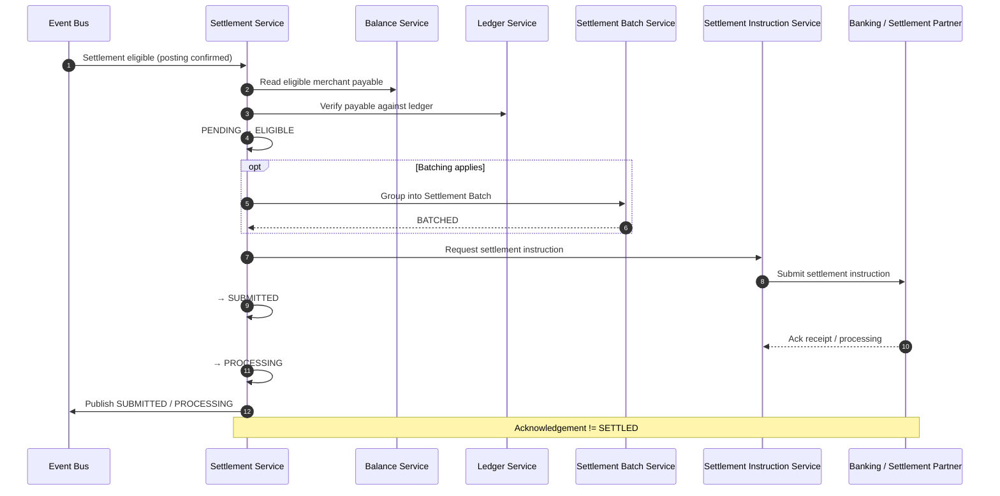

# Merchant Settlement

## Purpose

Eligible payable funds move through Settlement Service (optional batching) to the banking partner. Partner acknowledgement is **not** SETTLED.

## Preconditions

- Payment Workflow is COLLECTED.
- Ledger posting status is CONFIRMED.
- Merchant payable balance is eligible.

## Mermaid

## Important invariants

- Must not SUBMIT unless workflow COLLECTED and ledger posting CONFIRMED.
- Ack / PROCESSING is not terminal SETTLED.
- Settlement lifecycle is separate from Payment Workflow (ADR-006).

## Failure notes

- Partner unavailable → RETRY_PENDING / outage path (SEQ-OPS-004).
- Unknown outcome after submit → SEQ-MONEY-005 (do not blind resubmit).

## Related

LikeC4: `merchantSettlement`. STATE-MONEY-001.
