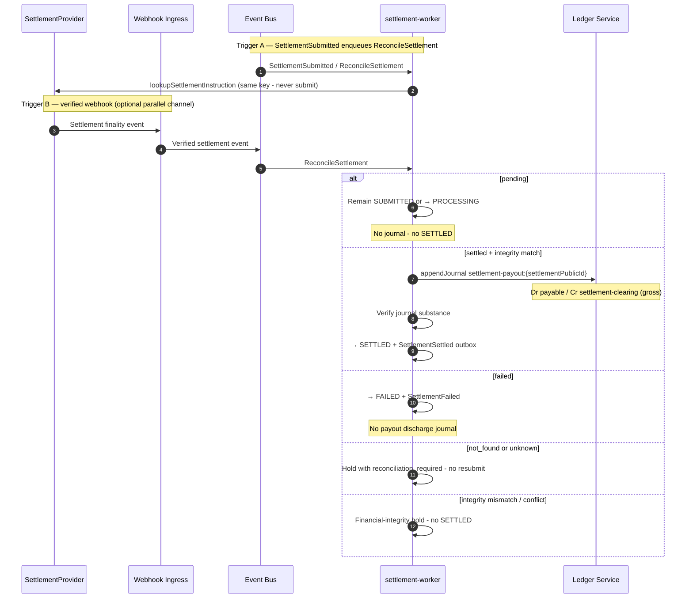
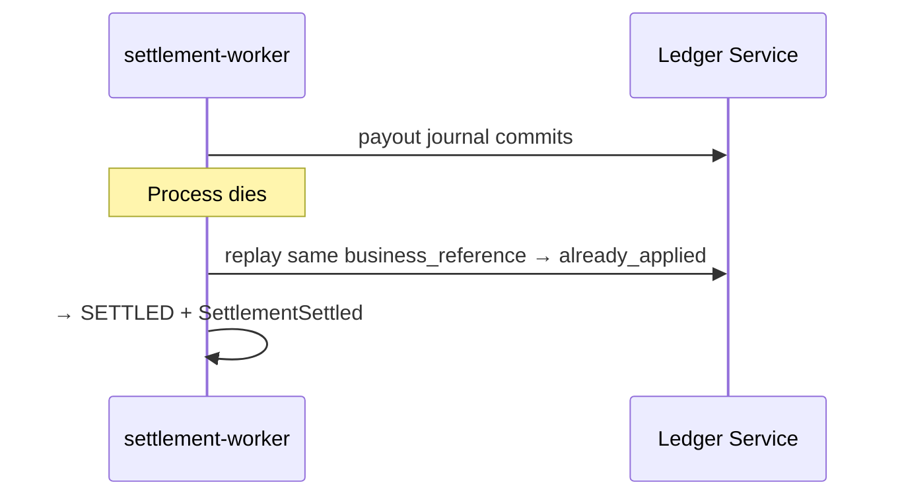

# Settlement Confirmation

## Purpose

After F1 `SUBMITTED`, settlement-worker reconciles provider finality (verified webhook and/or lookup). On canonical `settled`, appends the ADR-029 payout journal, then marks Settlement `SETTLED` and emits `SettlementSettled`. Merchant notification remains curated webhook (later Phase G).

Binding: [ADR-029](../../decisions/ADR-029-settlement-finality-reconciliation-payout-accounting.md).

## Preconditions

- Settlement is SUBMITTED or PROCESSING.
- SettlementInstruction exists (ACCEPTED or OUTCOME_UNKNOWN).
- Provider confirmation is signature-verified when webhook-sourced.
- Expected amount/currency/destination available for integrity match.

## Mermaid

### Crash after journal before SETTLED

## Important invariants

- SETTLED only after finality `settled` + durable payout journal.
- First network ack alone must not mark SETTLED.
- Reconciliation never calls submit.
- Merchant notification is curated webhook (ADR-023 / ADR-009) — Phase G delivery.

## Failure notes

- Reconciliation mismatch → do not invent SETTLED; escalate.
- Consumer payment remains COLLECTED regardless.
- `not_found` is not automatic FAILED and not resubmit.

## Related

LikeC4: `settlementConfirmation`. SEQ-MONEY-006 for merchant recon. ADR-029.
