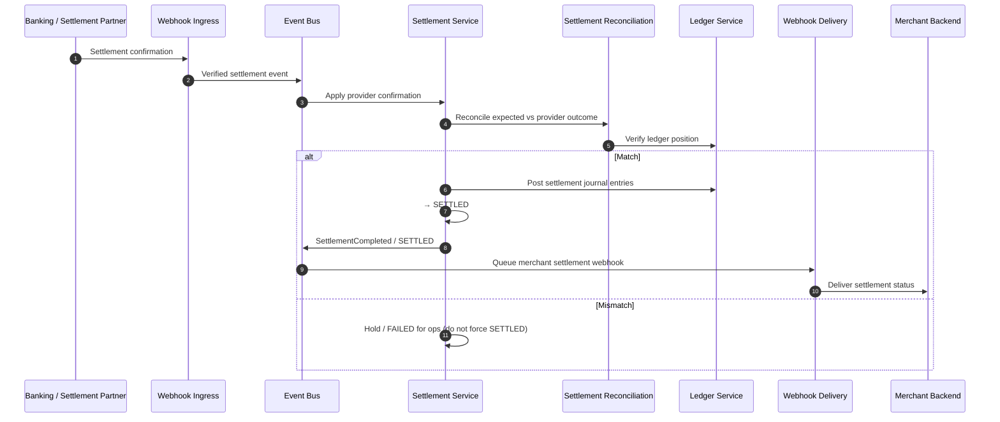

# Settlement Confirmation

## Purpose

Banking partner confirms settlement; reconciliation matches expected vs provider vs ledger; settlement becomes SETTLED; merchant is notified.

## Preconditions

- Settlement is SUBMITTED or PROCESSING.
- Provider confirmation event is signature-verified.
- Expected amount and ledger position are available for match.

## Mermaid

## Important invariants

- SETTLED only after confirmation + reconciliation match.
- First network ack alone must not mark SETTLED.
- Merchant notification is curated webhook (ADR-023 / ADR-009).

## Failure notes

- Reconciliation mismatch → do not invent SETTLED; escalate.
- Consumer payment remains COLLECTED regardless.

## Related

LikeC4: `settlementConfirmation`. SEQ-MONEY-006 for merchant recon.
