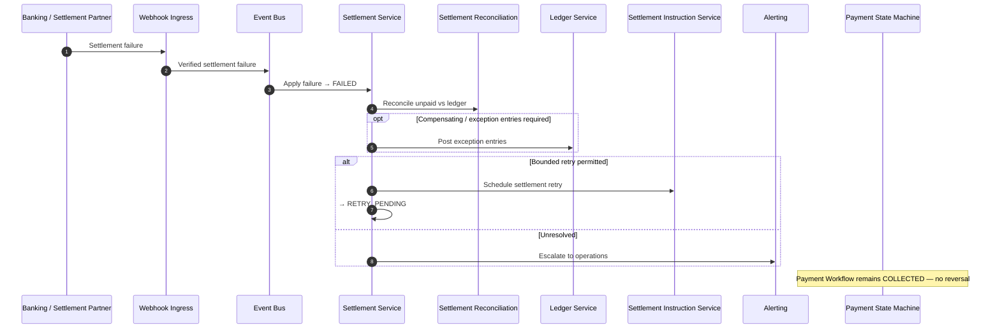

# Settlement Failure

## Purpose

Provider reports settlement failure. Consumer collection remains COLLECTED. Settlement may retry within bounds or escalate; do not reverse the successful consumer payment solely because merchant settlement failed.

## Preconditions

- Settlement was SUBMITTED or PROCESSING.
- Verified provider failure (or definitive negative reconciliation).

## Mermaid

## Important invariants

- Consumer payment stays COLLECTED.
- Do not reverse collection merely for settlement failure.
- FAILED → RETRY_PENDING only if product rules permit.

## Failure notes

- Exhausted settlement retries remain FAILED for ops handling.
- No Payment Workflow transition to FAILED from settlement failure.

## Related

LikeC4: `settlementFailure`. ADR-005 / ADR-006.
