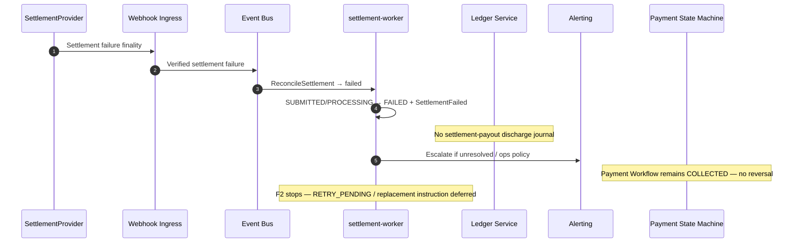

# Settlement Failure

## Purpose

Provider reports definitive settlement failure (submit `rejected` or reconcile `failed`). Consumer collection remains COLLECTED. Merchant payable remains undischarged. F2 does **not** invent replacement instructions or `RETRY_PENDING` business recovery.

## Preconditions

- Settlement was SUBMITTED or PROCESSING (or ELIGIBLE on F1 reject path).
- Verified provider failure or definitive reconcile outcome `failed`.

## Mermaid

## Important invariants

- Consumer payment stays COLLECTED.
- Do not reverse collection merely for settlement failure.
- Do not post ADR-029 payout journal on failure.
- FAILED → RETRY_PENDING only in a later phase when product rules permit (not F2).

## Failure notes

- Exhausted settlement retries (later) remain FAILED for ops handling.
- No Payment Workflow transition to FAILED from settlement failure.
- Reconcile `not_found` is **not** this path (integrity hold — ADR-029).

## Related

LikeC4: `settlementFailure`. ADR-005 / ADR-006 / ADR-029.
