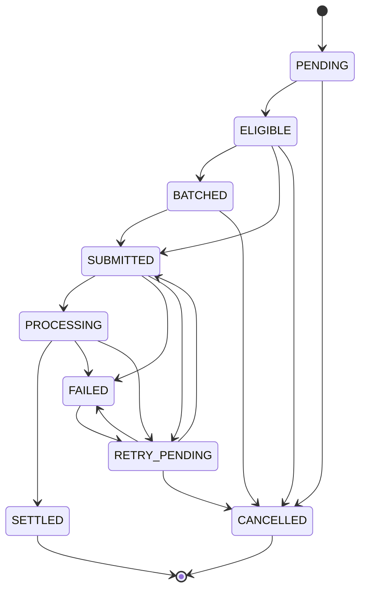

# Settlement State Machine

## Purpose

Legal settlement lifecycle states and transitions from `docs/schema/state-transitions.md` and `docs/money/settlement-state-machine.md`. Separate from Payment Workflow.

## Preconditions

- Settlement eligibility requires Payment Workflow COLLECTED and ledger posting CONFIRMED.
- Batching is optional; providers may skip BATCHED.

## Mermaid

## Important invariants

- Must not SUBMIT unless payment COLLECTED and ledger CONFIRMED.
- Ack alone is not SETTLED.
- Settlement FAILED does not reverse consumer COLLECTED.

## Failure notes

- Invalid: Payment not COLLECTED → SUBMITTED; SETTLED → SUBMITTED without reversal design; FAILED → SETTLED without confirmation + recon.

## Related

Payment workflow remains COLLECTED during settlement failure/outage.
