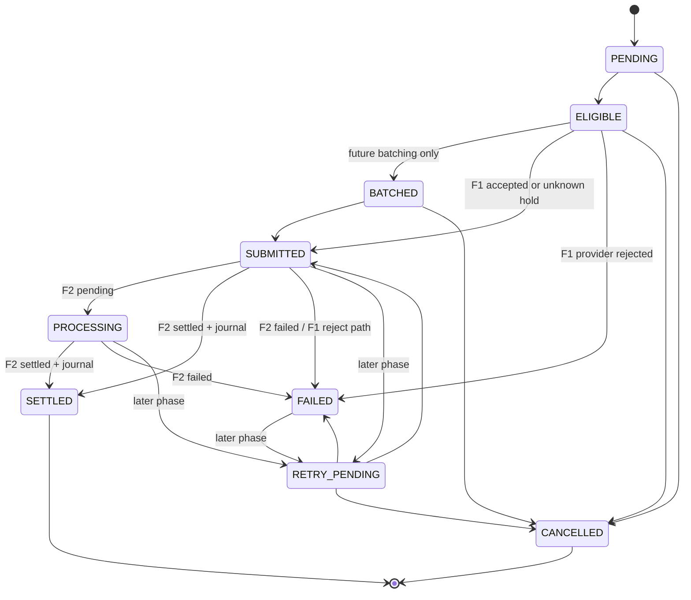

# Settlement State Machine

## Purpose

Legal settlement lifecycle states and transitions from `docs/schema/state-transitions.md` and `docs/money/settlement-state-machine.md`. Separate from Payment Workflow. Obligation/eligibility: [ADR-027](../../decisions/ADR-027-settlement-obligation-eligibility-cardinality.md). Execution: [ADR-028](../../decisions/ADR-028-settlement-execution-payout-destination-instruction-idempotency.md). Finality/accounting: [ADR-029](../../decisions/ADR-029-settlement-finality-reconciliation-payout-accounting.md).

## Preconditions

- Settlement creation requires Payment Workflow COLLECTED and ledger posting CONFIRMED.
- Initial status PENDING; ELIGIBLE after merchant/KYB gates.
- Batching is optional and **not used in F1/F2 MVP**; providers may skip BATCHED.
- Provider accepted → SUBMITTED; SETTLED only after ADR-029 finality + payout journal.

## Mermaid

## Important invariants

- Must not create/SUBMIT unless payment COLLECTED and ledger CONFIRMED.
- One Settlement per payment workflow (unique).
- One SettlementInstruction per Settlement (F1); same key on technical retry.
- Merchant/KYB block → remain PENDING (not FAILED); destination pre-submit fail → remain ELIGIBLE hold.
- Ack alone is not SETTLED; F1 ends at SUBMITTED; F2 requires finality + journal.
- Settlement FAILED does not reverse consumer COLLECTED.
- FAILED is recoverable via RETRY_PENDING when permitted later (not F2).
- Unknown / not_found → hold — not FAILED to force retry; not SETTLED.

## Failure notes

- Invalid: Payment not COLLECTED → SUBMITTED; SETTLED → SUBMITTED without reversal design; FAILED → SETTLED without confirmation + recon + journal; ineligibility → FAILED; unknown → FAILED to force retry; SETTLED without payout journal.

## Related

Payment workflow remains COLLECTED during settlement failure/outage. SEQ-MONEY-002. SEQ-MONEY-003. ADR-028. ADR-029.
