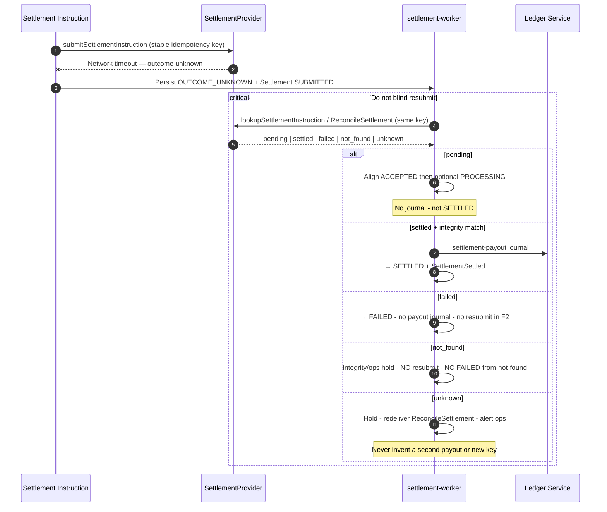

# Unknown Settlement Outcome

## Purpose

Network timeout after settlement submission leaves external outcome unknown. **Do not resubmit blindly.** Lookup/reconcile with the same instruction identity. Final `SETTLED` only via ADR-029 finality + payout journal.

Binding: [ADR-028](../../decisions/ADR-028-settlement-execution-payout-destination-instruction-idempotency.md), [ADR-029](../../decisions/ADR-029-settlement-finality-reconciliation-payout-accounting.md).

## Preconditions

- Settlement Instruction was submitted (or submit call timed out mid-flight).
- Local representation: Settlement **SUBMITTED** + instruction **OUTCOME_UNKNOWN** + `reconciliation_required`.

## Mermaid

## Important invariants

- Blind duplicate settlement instructions are forbidden.
- Provider query / reconciliation precedes any resubmit; F2 MVP **never** resubmits from reconcile (including `not_found`).
- Same instruction identity and idempotency key forever for this obligation (MVP).
- Do not mark FAILED merely to enable retry; do not mark SETTLED without ADR-029 evidence + journal.

## Failure notes

- Prolonged unknown → operations escalation; payment remains COLLECTED.
- See also SEQ-OPS-004 for partner outage.

## Related

LikeC4: `unknownSettlementOutcome`. Critical safety path. ADR-028. ADR-029.
