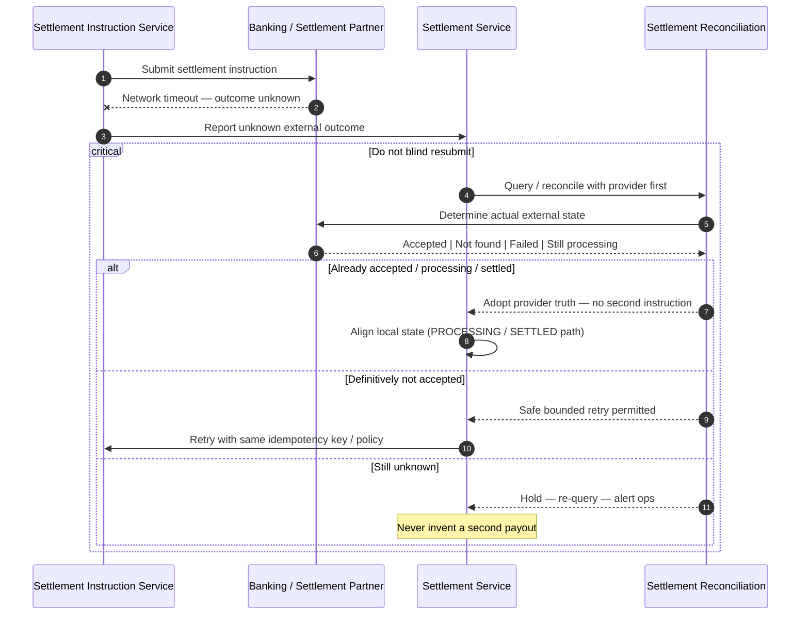

# Unknown Settlement Outcome

## Purpose

Network timeout after settlement submission leaves external outcome unknown. **Do not resubmit blindly.** Query/reconcile before any safe retry.

## Preconditions

- Settlement Instruction was submitted (or submit call timed out mid-flight).
- Local state may be SUBMITTED / PROCESSING / unknown.

## Mermaid

## Important invariants

- Blind duplicate settlement instructions are forbidden.
- Provider query / reconciliation precedes any resubmit.
- Prefer idempotent instruction keys when partner supports them.

## Failure notes

- Prolonged unknown → operations escalation; payment remains COLLECTED.
- See also SEQ-OPS-004 for partner outage.

## Related

LikeC4: `unknownSettlementOutcome`. Critical safety path.
