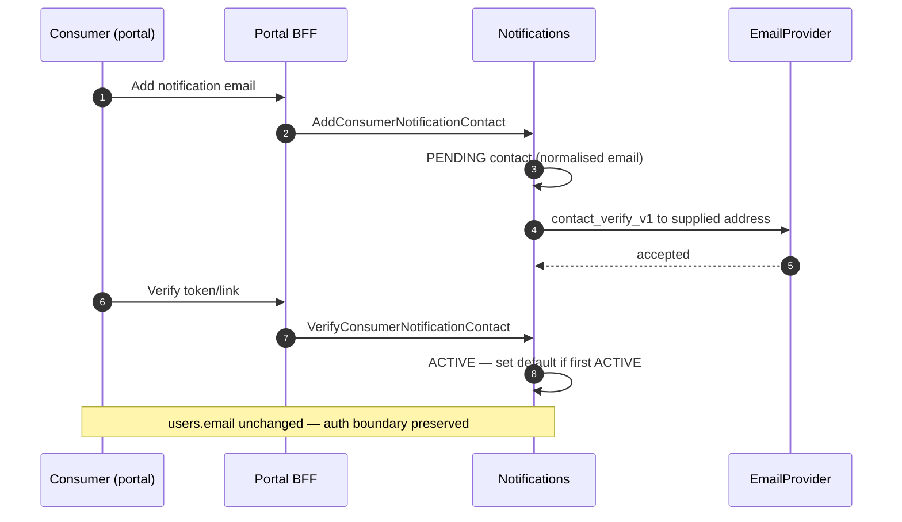

# Consumer notification contact onboarding

## Purpose

Explicit promotion of a communication destination separate from authentication identity.

## Preconditions

- Authenticated consumer portal session
- Supplied email ≠ automatic use of `users.email` unless user explicitly enters it

## Mermaid

## Invariants

- Verification required before payment notifications send
- Auth email never silently copied to contact table
