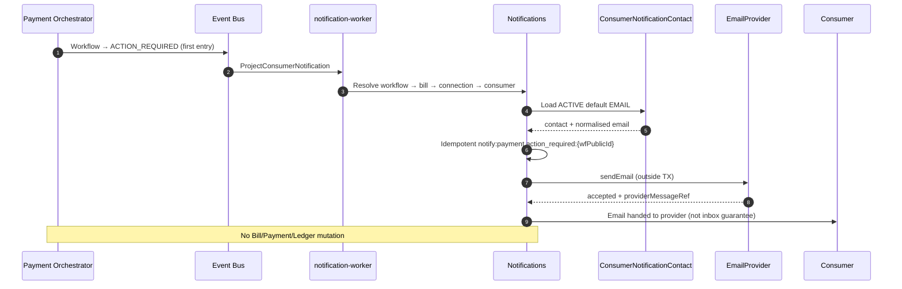

# Payment action required — consumer notification

## Purpose

When a payment workflow enters `ACTION_REQUIRED`, project and deliver a mandatory transactional email to the consumer's ACTIVE default notification contact.

## Preconditions

- Workflow transitioned to `ACTION_REQUIRED` (automatic recovery exhausted; window still open)
- Consumer has ACTIVE verified default email contact
- Closed mapping per ADR-031

## Mermaid

## No contact path

If no ACTIVE default contact: `ConsumerNotification` → `SKIPPED` (`NO_ACTIVE_CONTACT`); no EmailProvider call.

## Invariants

- One logical notification per workflow for this type
- No notification on every retryable decline
- Recipient from authoritative DB graph only
