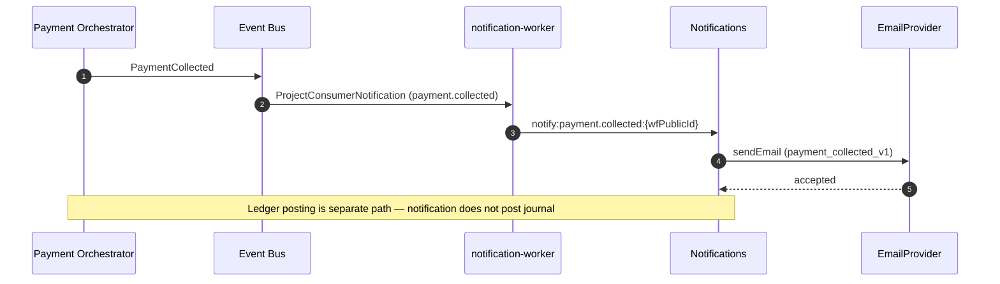

# Payment collected — consumer notification

## Purpose

Confirm successful payment collection to the consumer via mandatory transactional email.

## Preconditions

- `PaymentCollected` emitted
- Workflow `COLLECTED`
- Consumer ACTIVE default email (or SKIPPED)

## Mermaid

## Invariants

- One confirmation per collected workflow
- No settlement or ledger details in template variables
