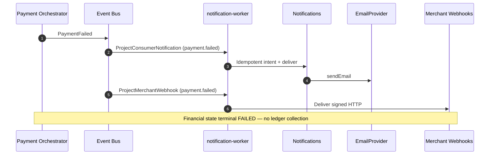

# Payment failed — consumer notification

## Purpose

On terminal `PaymentFailed`, deliver mandatory transactional email alongside merchant webhook (SEQ-PAY-006).

## Preconditions

- Workflow → `FAILED` with ADR-024/025 guards satisfied
- `PaymentFailed` emitted once
- Consumer ACTIVE default email (or SKIPPED)

## Mermaid

## Invariants

- Not triggered by intermediate declines or retryable attempts alone
- Same idempotency key on replay after crash
