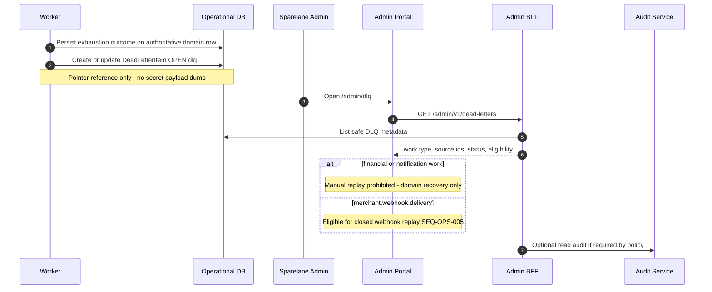

# Durable DLQ creation and inspection

## Purpose

After bounded automatic retries exhaust, operations persists a durable `DeadLetterItem`. Admins inspect safe metadata. Financial items are inspect-only. Webhook items may later enter closed replay (SEQ-OPS-005). Blind financial replay is prohibited.

## Preconditions

- Async work exhausted automatic handling
- Admin has `admin.dlq.view` for inspection

## Mermaid

## Postconditions

- Durable DLQ evidence exists and survives restart
- No financial command executed from inspection
- No raw secrets exposed in admin views

## Failure modes

- Duplicate exhaustion redelivery must not create a second logical `(work_type, source_identity)` row
- Missing capability denies list/detail
