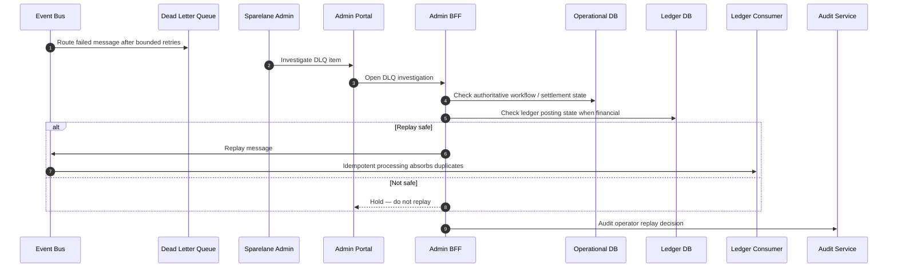

# DLQ Replay

## Purpose

Failed messages enter DLQ after bounded retries. Operators inspect authoritative state and replay only when safe. Financial side effects must not be blindly repeated. Operator action is audited.

## Preconditions

- Message exhausted bounded retries and is in Dead Letter Queue.
- Admin has privileged access with MFA.

## Mermaid

## Important invariants

- Inspect Operational DB / Ledger DB before replay.
- Financial consumers remain idempotent.
- Every operator replay is audited (ADR-012).

## Failure notes

- Blind replay of money side effects is forbidden.
- If journal already exists, replay must no-op.

## Related

LikeC4: `dlqReplay`.
