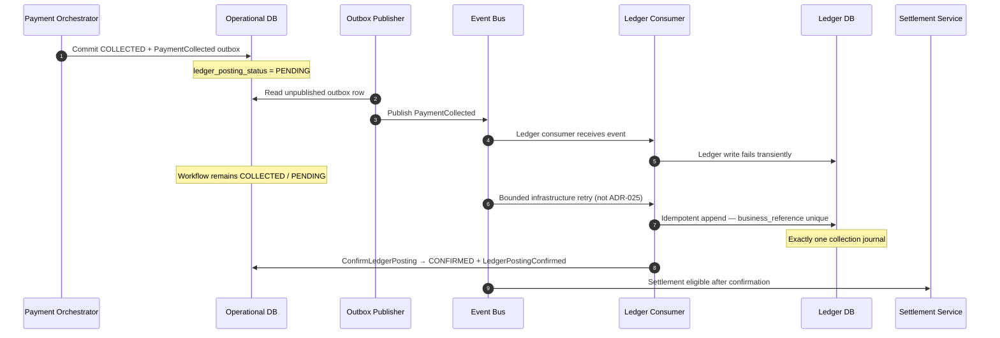

# Ledger Posting Recovery

## Purpose

Transactional outbox path: COLLECTED commits with `PaymentCollected` outbox; Ledger Consumer retries idempotently until **exactly one** ADR-026 collection journal exists; operational `ledger_posting_status` becomes **CONFIRMED**; settlement becomes eligible only after that confirmation.

## Preconditions

- Operational commit of COLLECTED + outbox succeeded.
- Ledger write may fail transiently after event publish.
- Crash may occur after ledger append before operational CONFIRMED.

## Mermaid

## Important invariants

- Exactly one journal posting per collection (`payment-collection:{pay_…}`).
- Journal exists before CONFIRMED.
- Conflicting substance for same reference → integrity failure; remain PENDING.
- Settlement eligibility only after CONFIRMED.
- At-least-once messaging must not create duplicate journals.
- Ledger failure does not change PaymentWorkflow.status away from COLLECTED.

## Failure notes

- Exhausted retries → DLQ (SEQ-OPS-003); inspect before replay.

## Related

LikeC4: `ledgerPostingRecovery`. ADR-016. ADR-026.
