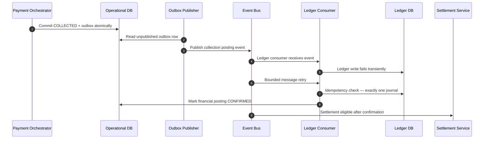

# Ledger Posting Recovery

## Purpose

Transactional outbox path: COLLECTED commits with outbox; Ledger Consumer retries idempotently until **exactly one** journal exists; settlement becomes eligible only after posting confirmation.

## Preconditions

- Operational commit of COLLECTED + outbox succeeded.
- Ledger write may fail transiently after event publish.

## Mermaid

## Important invariants

- Exactly one journal posting per collection (idempotent key).
- Settlement eligibility only after CONFIRMED.
- At-least-once messaging must not create duplicate journals.

## Failure notes

- Exhausted retries → DLQ (SEQ-OPS-003); inspect before replay.

## Related

LikeC4: `ledgerPostingRecovery`. ADR-016.
