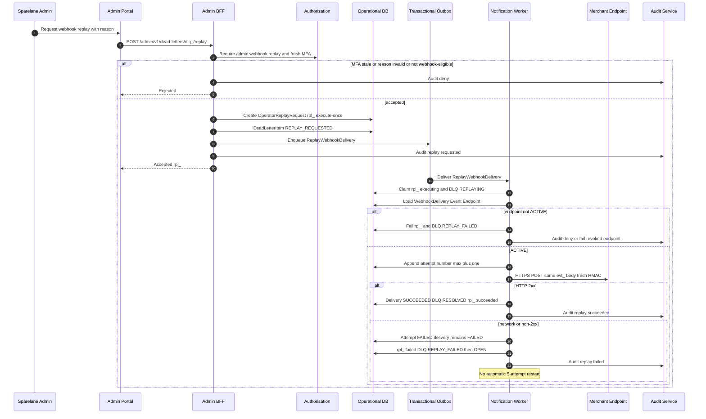

# Operator webhook replay

## Purpose

Closed-catalogue merchant webhook replay: single admin + recent MFA + reason creates `OperatorReplayRequest` (`rpl_…`). notification-worker appends a new delivery attempt on the same `WebhookDelivery`, preserving `evt_` and body with a fresh HMAC. No financial handlers. No automatic retry budget restart.

## Preconditions

- Durable DLQ item `OPEN` for `merchant.webhook.delivery`
- Endpoint `ACTIVE`
- Admin has `admin.webhook.replay` and MFA ≤15 minutes

## Mermaid

## Postconditions

- Same `evt_` and delivery identity preserved
- At-least-once transport; merchant dedupe required
- No Bill / Payment / Settlement / Ledger mutation

## Failure modes

- Concurrent second active `rpl_` for same DLQ denied
- Financial/notification replay paths must not enter this sequence
