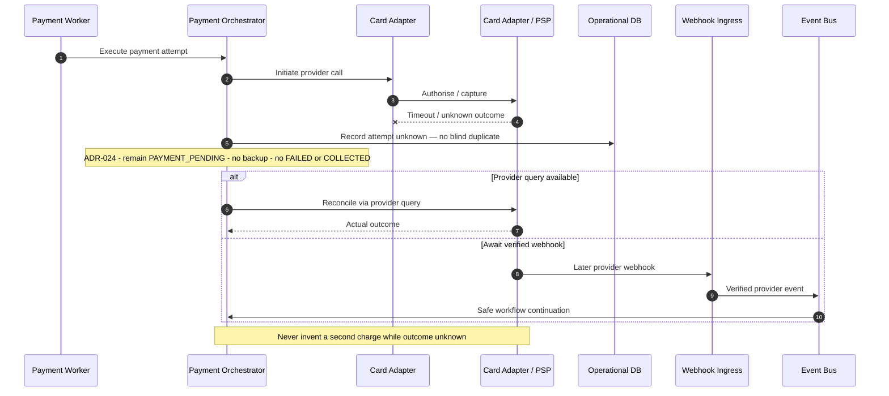

# Payment Provider Timeout

## Purpose

PSP timeout yields unknown outcome. Do **not** blindly duplicate the payment request; reconcile via provider query or verified webhook before safe workflow continuation ([ADR-024](../../decisions/ADR-024-payment-recovery-ordering-and-exhaustion.md)).

## Preconditions

- Payment Attempt submitted to Card Adapter / PSP.
- Transport timeout or ambiguous non-response.

## Mermaid

## Important invariants

- No blind duplicate payment submission.
- Unknown remains unknown until query or verified webhook.
- Idempotent provider keys used where supported.
- Workflow stays `PAYMENT_PENDING` while reconciliation is pending (no new workflow enum).
- After reconcile, apply ADR-024 to the resolved outcome.

## Failure notes

- Prolonged unknown → ops escalation; may move attempt to ERROR only under policy after reconcile.

## Related

LikeC4: `paymentProviderTimeout`. Parallel to SEQ-MONEY-005 for settlement. ADR-024.
