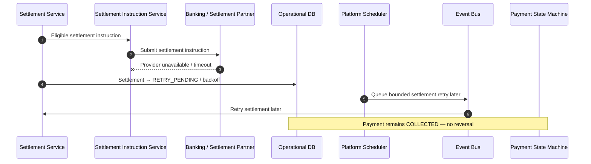

# Settlement Provider Outage

## Purpose

Settlement partner unavailability keeps settlement pending/retryable. Consumer payment remains COLLECTED. No payment reversal because the settlement rail is down.

## Preconditions

- Settlement eligible and instruction attempted.
- Banking / settlement partner unavailable or timing out.

## Mermaid

## Important invariants

- Payment Workflow stays COLLECTED.
- No consumer payment reversal due to settlement rail outage.
- Bounded settlement retries only; unknown mid-submit still follows SEQ-MONEY-005.

## Failure notes

- Prolonged outage → ops alert; unpaid settlement remains merchant-side settlement issue, not uncollect.

## Related

LikeC4: `settlementProviderOutage`. STATE-MONEY-001 RETRY_PENDING.
