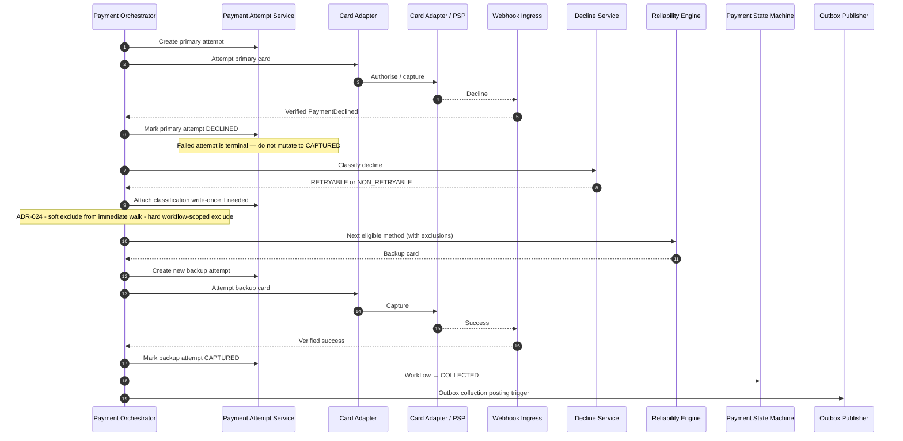

# Backup Recovery

## Purpose

Primary card fails with a classifiable decline; per [ADR-024](../../decisions/ADR-024-payment-recovery-ordering-and-exhaustion.md) Orchestrator excludes the current method from immediate selection when appropriate; Reliability Engine selects the next eligible backup; a **new** Payment Attempt succeeds. The failed attempt is not mutated into success.

## Preconditions

- Workflow is PAYMENT_PENDING (or recovering within the same due window).
- Primary attempt has a terminal failure (`DECLINED`) classified `RETRYABLE` or `NON_RETRYABLE`.
- At least one backup method remains eligible for the immediate walk.

## Mermaid

## Important invariants

- Retries and fallbacks create new attempt rows.
- Terminal attempts (DECLINED, ERROR, CAPTURED, CANCELLED) are immutable success/failure history.
- Only CAPTURED attempt supports workflow COLLECTED.
- Soft RETRYABLE does **not** retry the same method immediately when a backup is eligible (ADR-024 OPTION B).

## Failure notes

- No eligible backup after RETRYABLE + retry budget remains → SEQ-PAY-005 (`RETRY_PENDING`).
- No eligible backup after NON_RETRYABLE, or retry budget exhausted → `ACTION_REQUIRED` (ADR-024), not automatic FAILED.
- Recovery window closed → SEQ-PAY-006 (`FAILED`).

## Related

LikeC4: `backupRecovery`. ADR-003 workflow vs attempt. ADR-024 recovery ordering.
