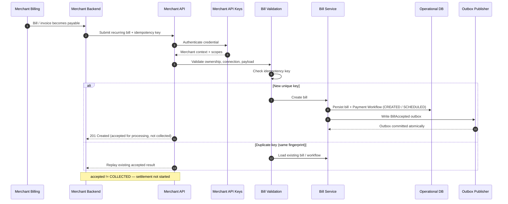

# Bill Ingestion

## Purpose

Show how a merchant bill enters Sparelane: authentication, validation, idempotency, bill persistence, Payment Workflow creation, and outbox publication. Acceptance means the bill is accepted for collection — not that funds are collected.

## Preconditions

- Merchant has a valid API credential with bill-submit scope.
- Consumer–merchant connection exists and is eligible for billing.
- Idempotency key supplied on the submit request.

## Mermaid

## Important invariants

- Bill accepted does not imply payment collected or merchant settled.
- Duplicate idempotency context with matching fingerprint must not create a second Payment Workflow.
- BillAccepted is published via transactional outbox with the operational write.

## Failure notes

- Auth or scope failure → reject before bill creation.
- Validation failure → reject; no workflow.
- Same key with mismatched fingerprint → conflict (see SEQ-INT-002).

## Related

LikeC4: `billIngestion`, `billSubmission`. ADRs and requirements in frontmatter.
