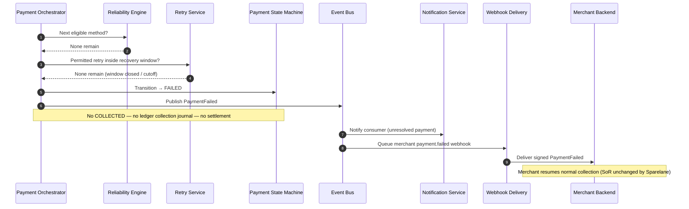

# Complete Failure

## Purpose

Recovery is **terminally** exhausted within the recovery window (or another ADR-024 FAILED trigger). Workflow becomes FAILED; merchant resumes normal collection. No ledger collection posting and no settlement.

Automatic exhaustion of methods/retry budget while the window remains open is **`ACTION_REQUIRED`**, not this sequence ([ADR-024](../../decisions/ADR-024-payment-recovery-ordering-and-exhaustion.md)).

Cutoff instant is defined by [ADR-025](../../decisions/ADR-025-payment-retry-timing-budget-and-recovery-window.md): `(dueDate + 7 calendar days) @ 09:00` frozen merchant timezone. UNKNOWN reconciliation pending or in-flight attempts **block** FAILED.

## Preconditions

- Reliability Engine reports no eligible methods remain (or would not change outcome), **or** cutoff closed with recoverable states still open.
- Retry Service / cutoff processor reports **`now >= cutoffAt`** with ADR-025 guards clear, **or** merchant cancellation / other explicit unrecoverable condition applies.
## Mermaid

## Important invariants

- FAILED is terminal for the Payment Workflow; no path to COLLECTED.
- No collection ledger posting; no settlement eligibility.
- Merchant invoice system of record is not rewritten by Sparelane.
- Late CAPTURED after FAILED is a financial-integrity / reconciliation condition — do not silently overwrite FAILED (ADR-024).

## Failure notes

- Webhook delivery may retry (SEQ-INT-004) but must reuse the same event ID.
- Do not invent settlement failure events for never-collected bills.
- Do not use this path merely because the immediate backup walk finished while the consumer can still remediate (`ACTION_REQUIRED`).

## Related

LikeC4: `completeFailure`. ADR-005 collection before settlement. ADR-024 exhaustion policy.
