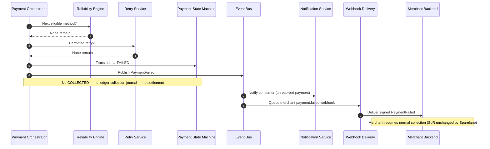

# Complete Failure

## Purpose

All eligible methods and permitted retries are exhausted. Workflow becomes FAILED; merchant resumes normal collection. No ledger collection posting and no settlement.

## Preconditions

- Reliability Engine reports no eligible methods remain.
- Retry Service reports no permitted retry remains (or recovery window closed).

## Mermaid

## Important invariants

- FAILED is terminal for the Payment Workflow; no path to COLLECTED.
- No collection ledger posting; no settlement eligibility.
- Merchant invoice system of record is not rewritten by Sparelane.

## Failure notes

- Webhook delivery may retry (SEQ-INT-004) but must reuse the same event ID.
- Do not invent settlement failure events for never-collected bills.

## Related

LikeC4: `completeFailure`. ADR-005 collection before settlement.
