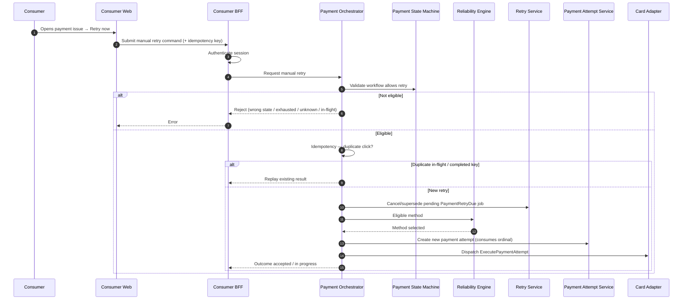

# Consumer Retry Now

## Purpose

Consumer-initiated manual retry: authenticate, validate workflow eligibility, create a new attempt, and protect duplicate concurrent clicks with idempotency.

**D5 MVP scope:** included. Budget semantics per [ADR-025](../../decisions/ADR-025-payment-retry-timing-budget-and-recovery-window.md): Retry Now **accelerates the next already-permitted scheduled ordinal**, consumes it, and cancels/supersedes the pending `ScheduledJob`. It does **not** grant extra attempts beyond max 3 per method.

## Preconditions

- Consumer is authenticated to Consumer Web / BFF.
- Workflow is in `RETRY_PENDING` or `ACTION_REQUIRED`.
- Recovery window open (`now < cutoffAt`).
- At least one eligible payment method exists (Rel).
- No UNKNOWN / reconciliation-pending attempt.
- No attempt currently in flight.

## Mermaid

## Important invariants

- Manual retry creates a new Payment Attempt; does not mutate prior terminal attempts.
- Duplicate concurrent Retry Now must be idempotent (same key → same outcome).
- Auth failure never reaches Orchestrator mutation.
- Race with scheduled due: exactly one attempt (D1 one-in-flight + job cancel + OCC).
- Does not bypass UNKNOWN reconciliation.
- Does not reset/extend recovery cutoff.

## Failure notes

- Soft decline after Retry Now may re-enter RETRY_PENDING / ACTION_REQUIRED under ADR-024/025.
- Cutoff closed → FAILED (SEQ-PAY-006), not Retry Now.

## Related

LikeC4: `consumerRetryNow`. FUN-CON-006. ADR-025.
