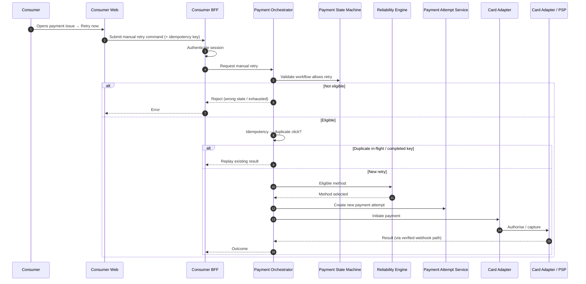

# Consumer Retry Now

## Purpose

Consumer-initiated manual retry: authenticate, validate workflow eligibility, create a new attempt, and protect duplicate concurrent clicks with idempotency.

## Preconditions

- Consumer is authenticated to Consumer Web / BFF.
- Workflow is in ACTION_REQUIRED or RETRY_PENDING (or other product-allowed retryable state).
- At least one eligible payment method exists.

## Mermaid

## Important invariants

- Manual retry creates a new Payment Attempt; does not mutate prior terminal attempts.
- Duplicate concurrent Retry Now must be idempotent (same key → same outcome).
- Auth failure never reaches Orchestrator mutation.

## Failure notes

- Soft decline after Retry Now may re-enter RETRY_PENDING / ACTION_REQUIRED.
- Hard exhaustion → FAILED (SEQ-PAY-006).

## Related

LikeC4: `consumerRetryNow`. FUN-CON-006.
