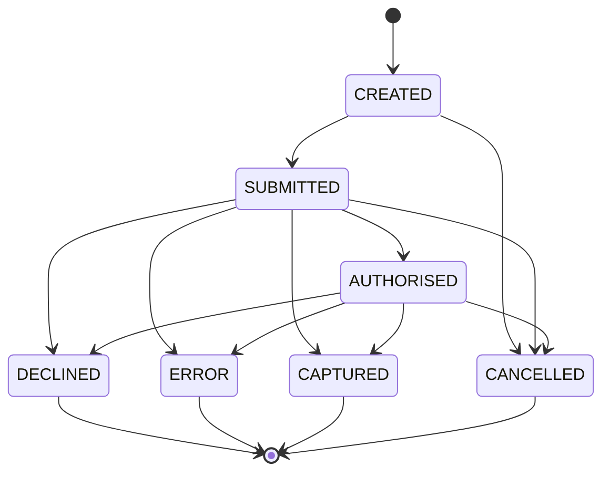

# Payment Attempt State Machine

## Purpose

State model for one concrete Payment Attempt against one method/rail. Retries and fallbacks create new attempts; terminal attempts are not rewritten to success.

## Preconditions

- Attempt belongs to an active Payment Workflow.
- Not every attempt visits every state (e.g. pre-auth may end AUTHORISED without CAPTURED).

## Mermaid

## Important invariants

- DECLINED / ERROR / CAPTURED / CANCELLED are terminal for that attempt.
- Workflow COLLECTED requires a CAPTURED collection attempt (not mere AUTHORISED pre-auth).
- New recovery creates a new attempt row.

## Failure notes

- Unknown provider timeout: leave attempt non-terminal or ERROR only after reconcile policy; do not blind-duplicate (SEQ-OPS-001).

## Related

Schema: `docs/schema/state-transitions.md`. Workflow: STATE-PAY-001.
