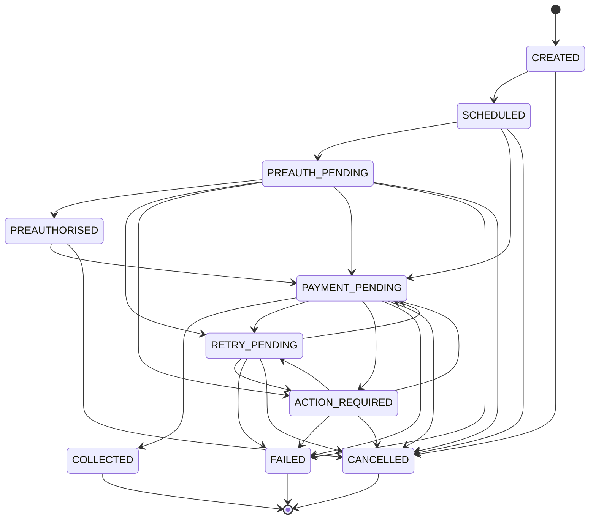

# Payment Workflow State Machine

## Purpose

Authoritative legal transitions for Payment Workflow lifecycle. Aligns with `docs/schema/state-transitions.md` and `docs/payments/payment-state-machine.md`.

## Preconditions

- Transitions occur only through Payment Orchestrator / Payment State Machine domain paths.
- Settlement is a separate lifecycle; COLLECTED does not imply SETTLED.

## Mermaid

## Important invariants

- Invalid examples: FAILED→COLLECTED, CREATED→COLLECTED, COLLECTED→PAYMENT_PENDING, PREAUTHORISED→COLLECTED.
- On COLLECTED set `ledger_posting_status = PENDING` (outbox path).
- Settlement eligibility requires `ledger_posting_status = CONFIRMED`.

## Failure notes

- Reject illegal transitions in domain logic; never via raw admin DB update.
- Pre-auth success must not skip to COLLECTED.

## Related

Schema: `docs/schema/state-transitions.md`. Attempt machine: STATE-PAY-002.
