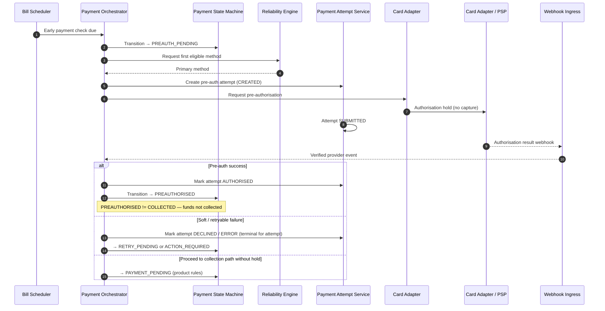

# Pre-authorisation

## Purpose

Early payment-method validation where the rail supports it. Pre-authorisation reduces later failure risk; it does **not** collect the bill.

## Preconditions

- Payment Workflow is SCHEDULED (or otherwise eligible for early check).
- An eligible payment method exists.
- Card Adapter / PSP supports pre-auth holds for the method.

## Mermaid

## Important invariants

- Pre-auth success must not jump to COLLECTED.
- Attempt ends AUTHORISED without CAPTURED for pure pre-auth.
- Failed attempt rows are not rewritten; recovery creates a new attempt later.

## Failure notes

- Provider timeout → treat as unknown; reconcile before duplicate pre-auth (see SEQ-OPS-001).
- Hard decline may move workflow to ACTION_REQUIRED or FAILED per Reliability Engine rules.

## Related

LikeC4: `preAuthorisation`. State model: STATE-PAY-001 / STATE-PAY-002.
