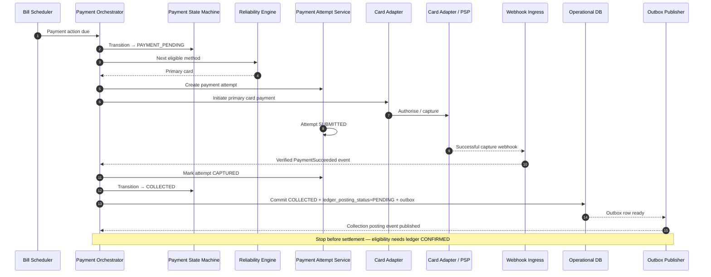

# Primary Card Success

## Purpose

Happy-path collection on the primary card: workflow reaches COLLECTED, outbox is written, and ledger posting is triggered. Settlement detail is out of scope here.

## Preconditions

- Payment Workflow is SCHEDULED, PREAUTHORISED, or otherwise due for collection.
- Primary card is eligible.
- Risk checks allow the attempt.

## Mermaid

## Important invariants

- COLLECTED means consumer funds collected — not merchant settled.
- COLLECTED and outbox write are atomic on Operational DB.
- Settlement eligibility requires `ledger_posting_status = CONFIRMED` (see SEQ-MONEY-001).

## Failure notes

- Capture decline → backup / retry paths (SEQ-PAY-004 / SEQ-PAY-005), not settlement.
- Do not mark SETTLED from this flow.

## Related

LikeC4: `primaryCardSuccess`, `paymentLifecycle`. Continues in SEQ-MONEY-001.
