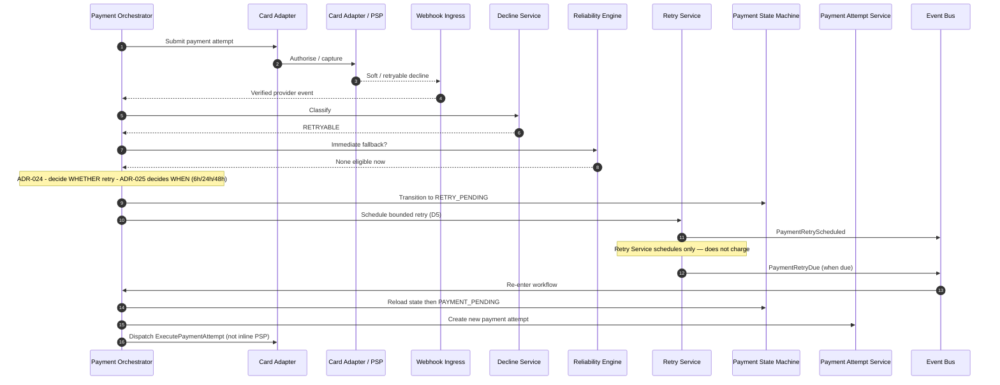

# Scheduled Retry

## Purpose

Soft/retryable failure with no immediate fallback (or technical known no-charge per [ADR-024](../../decisions/ADR-024-payment-recovery-ordering-and-exhaustion.md)): Orchestrator decides **RETRY_PENDING**; Retry Service schedules timing only per [ADR-025](../../decisions/ADR-025-payment-retry-timing-budget-and-recovery-window.md); Payment Orchestrator later reloads state and creates a **new** Payment Attempt.

## Preconditions

- Attempt failed with `RETRYABLE` classification (or `TECHNICAL_ERROR` known no-charge).
- For RETRYABLE: Reliability Engine confirms no immediate eligible fallback.
- Bounded same-method retry budget remains (ADR-025: max 3 scheduled ordinals 1..3).

## Mermaid

## Important invariants

- Retry Service does not submit to PSP; Orchestrator owns attempts.
- Failed attempt is not mutated; due retry creates a new attempt.
- RETRY_PENDING → PAYMENT_PENDING is the legal re-entry (state schema).
- Decline Classification does not call Retry Service.

## Failure notes

- Retry budget exhausted while recovery window open → `ACTION_REQUIRED` (ADR-024).
- Recovery window / cutoff exhausted (`cutoffAt`, ADR-025) → FAILED (SEQ-PAY-006), unless UNKNOWN/in-flight guards block.
- Consumer/merchant intervention needed without remaining automatic retry → `ACTION_REQUIRED`.

## Related

LikeC4: `scheduledRetry`. STATE-PAY-001 transitions. ADR-024. ADR-025.
