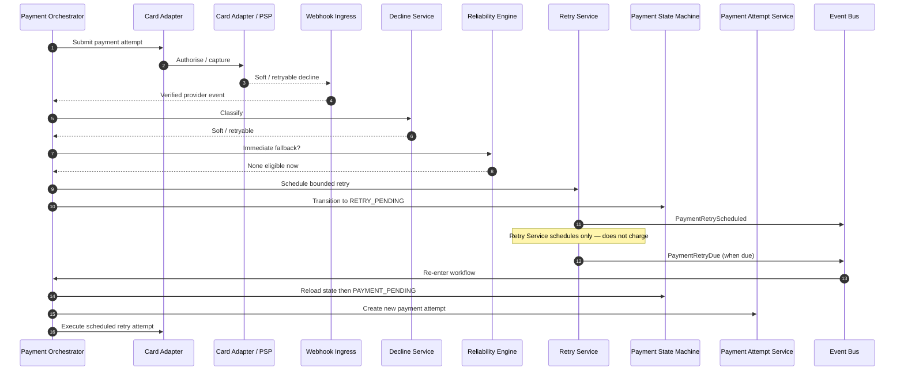

# Scheduled Retry

## Purpose

Soft/retryable failure with no immediate fallback: Retry Service schedules timing only; Payment Orchestrator later reloads state and creates a **new** Payment Attempt.

## Preconditions

- Attempt failed with soft/retryable classification.
- Reliability Engine confirms no immediate eligible fallback.
- Bounded retry budget remains.

## Mermaid

## Important invariants

- Retry Service does not submit to PSP; Orchestrator owns attempts.
- Failed attempt is not mutated; due retry creates a new attempt.
- RETRY_PENDING → PAYMENT_PENDING is the legal re-entry (state schema).

## Failure notes

- Retry budget exhausted → FAILED (SEQ-PAY-006).
- Consumer/merchant intervention needed → ACTION_REQUIRED.

## Related

LikeC4: `scheduledRetry`. STATE-PAY-001 transitions.
