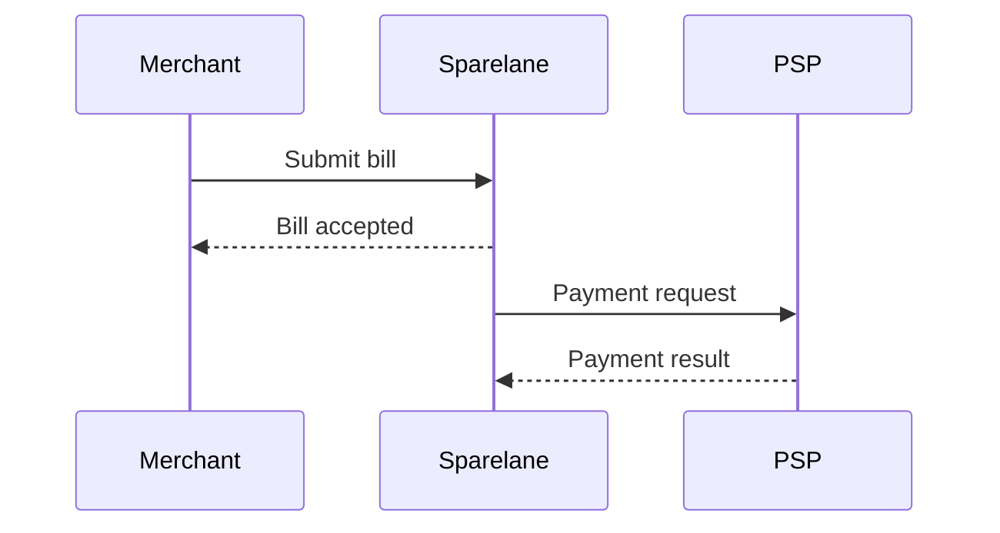
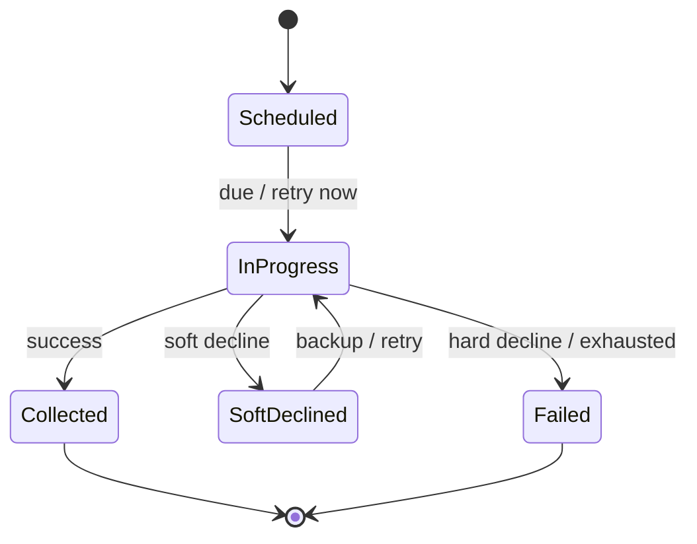

# Portal Mermaid Rendering Test

Portal regression fixture to prove Mermaid rendering in the custom architecture portal. **Not** a primary engineering design artefact.

Detailed Mermaid diagrams in `docs/design/` supplement LikeC4 model-driven views; they do not replace them. LikeC4 remains the architecture source of truth.

## Sequence diagram

Bill submission and payment request handoff:

## State diagram

Simplified Payment Workflow states (illustrative — authoritative state machine is in LikeC4 and `docs/design/payments/payment-workflow-state.md`):

