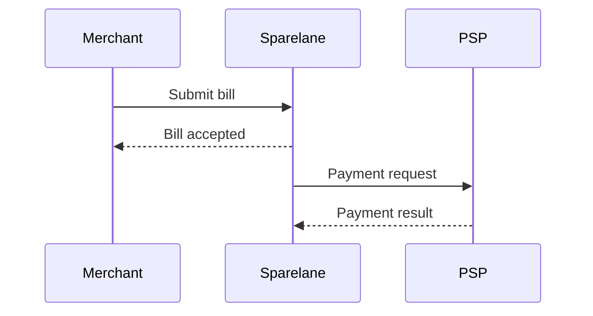
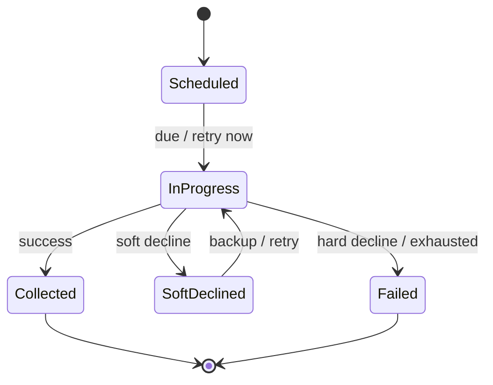

# Portal Mermaid Test

Temporary design page to prove Mermaid rendering in the custom architecture portal.

Detailed Mermaid diagrams **supplement** LikeC4 model-driven views; they do not replace them.

## Sequence diagram

Bill submission and payment request handoff:

## State diagram

Simplified Payment Workflow states (illustrative — authoritative state machine is in LikeC4 and `docs/payments/`):

