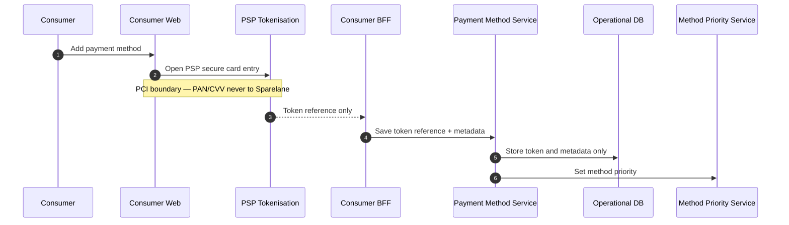

# Add Tokenised Card

## Purpose

Consumer adds a card via PSP secure capture. PAN/CVV never enter Sparelane application storage; Sparelane stores only the token reference and permitted metadata.

## Preconditions

- Consumer authenticated in Consumer Web.
- PSP tokenisation / hosted fields available.

## Mermaid

## Important invariants

- Raw CHD (PAN/CVV) never traverses Sparelane app storage (ADR-001, ADR-010).
- Sparelane holds token reference + display metadata only.
- PCI scope remains with the tokenisation provider for card capture.

## Failure notes

- Tokenisation failure → no Sparelane payment method row.
- Never log or persist PAN/CVV in Sparelane logs/DB.

## Related

LikeC4 dynamic view `addPaymentMethod` (architecture). FUN-CON-003.
