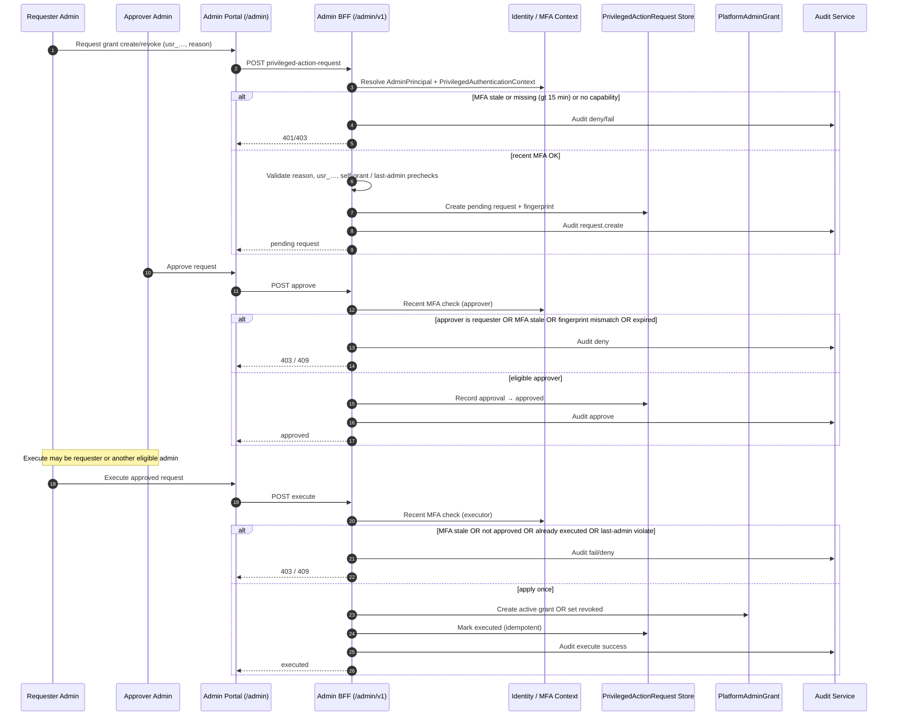

# Admin Grant Dual Control (H1 Option A)

## Purpose

Platform admin **grant create/revoke** under dual control and recent MFA: request → approve → execute, with durable audit.

**H0 reads unchanged:** see [SEQ-SEC-005](./admin-read-only-control-plane.md) and [ADR-032](../../decisions/ADR-032-platform-admin-authority-read-only-control-plane.md) — inspection paths are not altered by this sequence.

Generic privileged-action sketch: [SEQ-SEC-004](./admin-privileged-action.md). This sequence is the **binding** H1 grant path ([ADR-033](../../decisions/ADR-033-privileged-admin-grant-management-and-approval.md)).

## Preconditions

- Requester and approver each have active `PlatformAdminGrant` and capability `admin.grant.manage`
- Target User addressed by mandatory `usr_…` public ID
- `PrivilegedAuthenticationContext` can supply `mfaSatisfiedAt` within 15 minutes for each privileged step (provider per OD-023/OD-024)
- Not a self-grant; last-active-admin rules enforceable at request and execute

## Mermaid

## Important invariants

- Closed actions only: `admin.grant.create`, `admin.grant.revoke`.
- Dual control: requester ≠ approver; both active platform admins; one approval; 24h expiry; fingerprint immutability.
- Recent MFA (≤15 minutes) on request, approve, and execute.
- Self-grant prohibited; self-approve prohibited; self-revoke only with other-admin approval and not last admin.
- Approved request executes **once**.
- H0 read-only control plane sequences and capabilities remain in force for GET inspection.

## Failure notes

- Failed MFA / capability / dual-control rule → reject step; durable deny/fail audit.
- Expiry → terminal `expired`; no execute.
- Last-admin revoke → reject at validation and execute.

## Related

[ADR-033](../../decisions/ADR-033-privileged-admin-grant-management-and-approval.md). LikeC4 dynamic view may track `adminGrantDualControl` when modelled.
