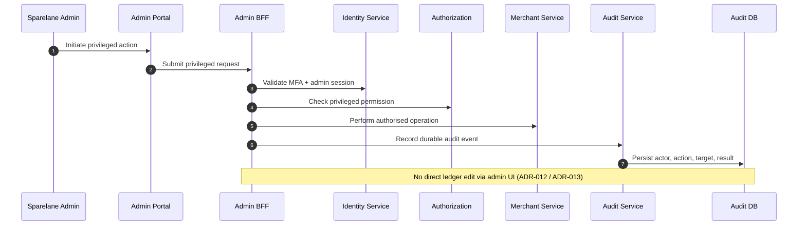

# Admin Privileged Action

## Purpose

Privileged admin **mutations** require MFA/session validation, explicit authorisation, and durable audit. Admin must not edit the ledger directly through UI.

**H0 (read-only):** see [SEQ-SEC-005](./admin-read-only-control-plane.md) and [ADR-032](../../decisions/ADR-032-platform-admin-authority-read-only-control-plane.md) — no privileged mutations in H0.

**H1 (grant management only):** SEQ-SEC-004 remains the **general** privileged-mutation pattern. The binding H1 grant create/revoke flow is **[SEQ-SEC-006](./admin-grant-dual-control.md)** ([ADR-033](../../decisions/ADR-033-privileged-admin-grant-management-and-approval.md)). **No financial mutations, replay, or corrections in H1.**

## Preconditions

- Admin user with privileged role / capability.
- MFA challenge satisfiable for the action class (H1: recent MFA ≤15 min).

## Mermaid

## Important invariants

- MFA + authorisation before privileged mutation.
- Durable audit for actor/action/target/result.
- Ledger mutations only via Ledger Service domain paths — never raw admin writes.
- H1 Option A: grant actions only via dual-control PrivilegedActionRequest (SEQ-SEC-006) — not this generic single-step path for grants.

## Failure notes

- Failed MFA or permission → reject; still audit deny where policy requires.
- Dual-control for grants bound by ADR-033; break-glass NOT SUPPORTED; other dual-control matrices deferred H2+.

## Related

LikeC4 dynamic view `adminPrivilegedAction`. ADR-011 / ADR-012. H1 grants: SEQ-SEC-006 / ADR-033.
