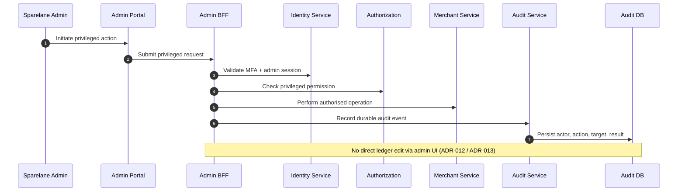

# Admin Privileged Action

## Purpose

Privileged admin actions require MFA/session validation, explicit authorisation, and durable audit. Admin must not edit the ledger directly through UI.

## Preconditions

- Admin user with privileged role.
- MFA challenge satisfiable for the action class.

## Mermaid

## Important invariants

- MFA + authorisation before privileged mutation.
- Durable audit for actor/action/target/result.
- Ledger mutations only via Ledger Service domain paths — never raw admin writes.

## Failure notes

- Failed MFA or permission → reject; still audit deny where policy requires.
- Dual-control workflows remain TBD product-wise.

## Related

LikeC4 dynamic view `adminPrivilegedAction`. ADR-011 / ADR-012.
